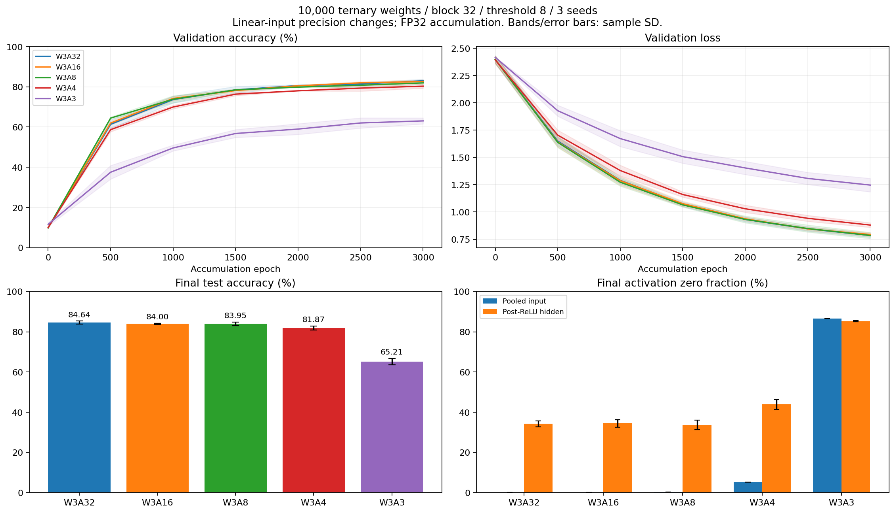

# W3A32・W3A16・W3A8・W3A4・W3A3の比較

10,000パラメータ、block=32、発火閾値=8、seed=[0, 1, 2]。
訓練10000件・検証1000件・テスト10,000件、K=64、3000区間、batch=128。
同じseedで重み初期化・データ・訓練バッチ・摂動乱数・票の丸め乱数を対応させた。
活性化の量子化は決定的で、乱数を消費しない。各精度でスクラッチから学習し、検証値で更新を選別しない。

## 精度の定義

量子化するのは各線形層への入力（正規化済み画像入力とReLU後の隠れ層出力）。
行列積の累積・中間線形出力・ReLU計算・最終logit・損失はFP32。逆伝播とSTEは使わない。
| 設定 | 活性化の表現 |
| --- | --- |
| A32 | FP32、そのまま |
| A16 | FP16にキャストし、FP32に戻して行列積へ渡す |
| A8 | 符号付き整数コード−127～127（255段階）とFP32スケール |
| A4 | 符号付き整数コード−7～7（15段階）とFP32スケール |
| A3 | コード−1・0・+1の3値とFP32スケール。3ビットではない |

整数系は各サンプル・各層のmax(abs(x))/qmaxをスケールとし、最近傍（同距離は偶数）へ丸める。
q = clamp(round(x / scale), -qmax, qmax)、復元値はscale*q。全ゼロ行ではscale=1。
スケールは各候補のforwardごとに再計算する。データに依存する補助スケールもFP32で保持する。
ReLU後は非負なので、A3の隠れ層入力で実際に使われるコードは0と+1の2値。
A8/A4のReLU後も対称符号付き範囲の非負側を使い、符号なし範囲への変更はしていない。
A8/A4/A3はINT8コンテナへ符号化してからFP32へ復元する。sub-byte packingや専用整数GEMMは未使用。
これは活性化表現の精度が学習に与える影響の比較で、演算速度・メモリ帯域の優位性を測るものではない。

## 結果

平均±標本標準偏差。

| 設定 | 検証loss | 検証精度 % | テスト精度 % | 発火数 | 損失改善seed |
| --- | ---: | ---: | ---: | ---: | ---: |
| W3A32 | 0.7858 ± 0.0168 | 83.03 ± 0.75 | 84.64 ± 0.73 | 2960.7 ± 10.7 | 3/3 |
| W3A16 | 0.7942 ± 0.0175 | 82.63 ± 0.84 | 84.00 ± 0.29 | 2958.3 ± 3.5 | 3/3 |
| W3A8 | 0.7855 ± 0.0283 | 81.97 ± 0.74 | 83.95 ± 0.89 | 2953.3 ± 9.5 | 3/3 |
| W3A4 | 0.8808 ± 0.0215 | 80.33 ± 1.02 | 81.87 ± 0.99 | 2966.3 ± 3.8 | 3/3 |
| W3A3 | 1.2467 ± 0.0618 | 63.07 ± 1.50 | 65.21 ± 1.54 | 2958.7 ± 5.5 | 3/3 |

activation_diagnostics.csvに初期・最終検証時の各層のゼロ率と量子化誤差を保存。
誤差は各モデルの各層で量子化直前と復元後を比較した値で、A32モデルとの差ではない。
FP64の誤差集計は読み取り専用の診断で、forwardや重み更新の計算には使わない。
summaries.jsonに整数コードの分布・層別更新数・カウンタ分布を保存。
各実験の設定・学習曲線・重み: `/root/lowbit-math-reasoning/tdt_mnist/runs/activation-grid-10k-20260905`

## 読み取りと再現手順

全15実験で検証損失と検証精度が初期値から改善しました。両層とも更新されています。
A32は前回の10,000パラメータ・block=32・閾値8の3seedを、損失・精度・発火数・層別更新数まで完全に再現しました。
検証精度はA32の83.03%に対して、A16は82.63%、A8は81.97%、A4は80.33%、A3は63.07%でした。
発火数の平均は全精度で約2,950～2,970回です。A3でも更新は進みますが、今回の量子化方式では精度が大きく低下しました。
下記は最終検証時の診断値の3seed平均です。相対二乗誤差は量子化直前の信号エネルギーに対する二乗誤差の比です。

| 設定 | 入力ゼロ率 % | 隠れ層ゼロ率 % | 入力の相対二乗誤差 | 隠れ層の相対二乗誤差 |
| --- | ---: | ---: | ---: | ---: |
| W3A32 | 0.00 | 34.20 | 0 | 0 |
| W3A16 | 0.00 | 34.48 | 4.73795e-08 | 4.32422e-08 |
| W3A8 | 0.29 | 33.73 | 4.65278e-05 | 2.7993e-05 |
| W3A4 | 5.28 | 43.84 | 0.0131026 | 0.00941355 |
| W3A3 | 86.66 | 85.30 | 0.416276 | 0.438692 |



[SVG形式](activation_comparison.svg)

再現コマンド（tdt_mnist内で実行）:

```bash
uv run python sweep_activations.py --workers 5 \
  --output-dir runs/activation-grid-repeat --report-dir results/activation-grid-repeat
uv run python plot_activations.py results/activation-grid-repeat
```
