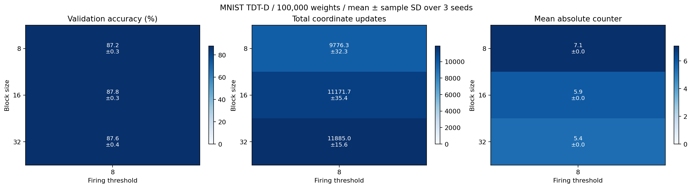
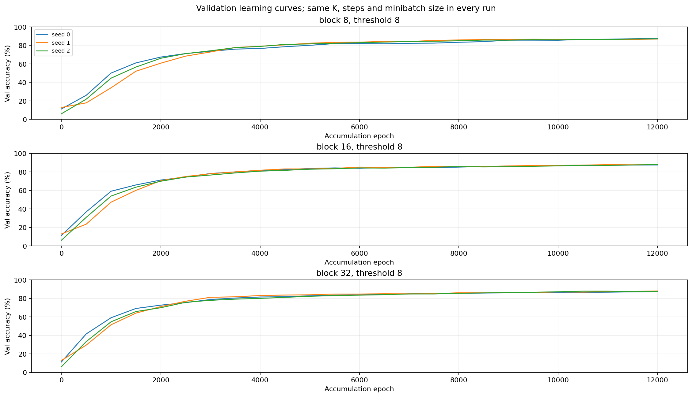
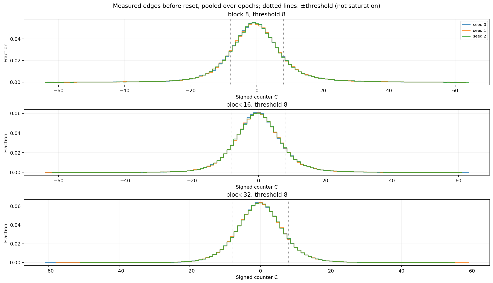

# MNIST TDT: 100k・FP32のブロックサイズと学習区間比較

90→1000→10、バイアスなし、三値重み100,000個、活性化・積和・損失FP32。seed=[0, 1, 2]。
発火閾値8、K=64、batch=128、最大発火1重み/区間。区間ごとにカウンタをリセット。
訓練10,000件、検証1,000件、テスト10,000件。データ分割seed=0。逆伝播は使わない。
学習区間はカウンタ蓄積・更新の単位で、データ全体を一巡するepochではない。
各長さを初期状態から独立に実行。同じseedの初期重み・バッチ乱数列を共有。
同じ区間数では訓練forward回数が等しく、区間数の比較では学習量そのものが異なる。
値は3seedの平均±標本標準偏差。テスト評価を更新・停止・条件選択に使わない。

| 区間 | block | 検証精度 % | テスト精度 % | 発火数 |
| ---: | ---: | ---: | ---: | ---: |
| 12000 | 8 | 87.17 ± 0.31 | 88.33 ± 0.13 | 9776.3 |
| 12000 | 16 | 87.80 ± 0.26 | 88.55 ± 0.22 | 11171.7 |
| 12000 | 32 | 87.57 ± 0.38 | 88.42 ± 0.15 | 11885.0 |

カウンタの最大・平均・絶対値平均・容量・飽和率・発火数・層別更新数はper_seed.csv、
符号付き分布はcounter_histograms.csv、条件別の詳細はsteps*/README.md。
カウンタ分布は各区間末の測定済み辺だけを集計。INT8容量±127。
詳細ログ・設定・重み: `/root/lowbit-math-reasoning/tdt_mnist/runs/blocks-8-16-32-100k-12k-20260905`

## 結果と確認事項

全9実験で初期状態から検証損失が低下し、検証精度が向上した。両層の重み更新を確認。
今回の平均検証精度はblock=16が最高（87.80±0.26%）。テスト精度は88.55±0.22%。
block=32との差は検証0.23ポイント、テスト0.13ポイントと小さく、3seedの結果から一般的な優位性までは確定しない。
発火数はblockを増やすと多くなったが、精度は単調には増えなかった。
設定・訓練forward数・三値重み・層別更新数・カウンタ集計・ソースハッシュの検証が通過。
今回は12,000区間のみを実行したため、verification.jsonの区間長間の接頭比較数は0（対象なし）。
別途、block=8・32の3,000区間時点の検証損失・精度・発火数が、以前の100k実験と全6組で一致することを確認。

## カウンタ統計

各区間末の測定済み辺を集計。平均はseed平均、最大絶対値は全seed最大。INT8容量は±127。

| block | 平均C | 平均abs(C) | 最大abs(C) | 飽和件数 |
| ---: | ---: | ---: | ---: | ---: |
| 8 | -0.271 | 7.066 | 64 | 0 |
| 16 | -0.130 | 5.913 | 64 | 0 |
| 32 | -0.062 | 5.396 | 61 | 0 |

## 再実行

リポジトリのルートから、保存先は新規ディレクトリを指定:

```bash
python tdt_mnist/sweep_lengths.py --blocks 8 16 32 --lengths 12000 \
  --seeds 0 1 2 --threshold 8 --workers-per-length 9 \
  --output-dir tdt_mnist/runs/blocks-8-16-32-repeat \
  --report-dir tdt_mnist/results/blocks-8-16-32-repeat
python tdt_mnist/verify_lengths.py tdt_mnist/results/blocks-8-16-32-repeat
python tdt_mnist/plot_sweep.py tdt_mnist/results/blocks-8-16-32-repeat/steps12000
```

[seed別CSV](per_seed.csv) / [平均・標準偏差CSV](aggregate.csv) / [検証記録](verification.json)






