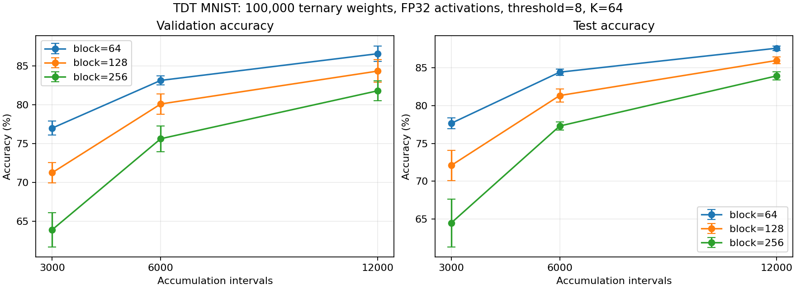

# MNIST TDT: 100k・FP32のブロックサイズと学習区間比較

90→1000→10、バイアスなし、三値重み100,000個、活性化・積和・損失FP32。seed=[0, 1, 2]。
発火閾値8、K=64、batch=128、最大発火1重み/区間。区間ごとにカウンタをリセット。
訓練10,000件、検証1,000件、テスト10,000件。データ分割seed=0。逆伝播は使わない。
学習区間はカウンタ蓄積・更新の単位で、データ全体を一巡するepochではない。
各長さを初期状態から独立に実行。同じseedの初期重み・バッチ乱数列を共有。
同じ区間数では訓練forward回数が等しく、区間数の比較では学習量そのものが異なる。
値は3seedの平均±標本標準偏差。テスト評価を更新・停止・条件選択に使わない。

| 区間 | block | 検証精度 % | テスト精度 % | 発火数 |
| ---: | ---: | ---: | ---: | ---: |
| 3000 | 64 | 77.00 ± 0.92 | 77.65 ± 0.72 | 2997.7 |
| 3000 | 128 | 71.27 ± 1.30 | 72.09 ± 2.00 | 2999.3 |
| 3000 | 256 | 63.93 ± 2.20 | 64.50 ± 3.15 | 3000.0 |
| 6000 | 64 | 83.13 ± 0.59 | 84.41 ± 0.42 | 5997.3 |
| 6000 | 128 | 80.10 ± 1.30 | 81.32 ± 0.86 | 5999.3 |
| 6000 | 256 | 75.63 ± 1.67 | 77.30 ± 0.53 | 6000.0 |
| 12000 | 64 | 86.57 ± 1.01 | 87.57 ± 0.31 | 11996.7 |
| 12000 | 128 | 84.33 ± 1.45 | 85.95 ± 0.45 | 11999.3 |
| 12000 | 256 | 81.80 ± 1.30 | 83.92 ± 0.56 | 12000.0 |

カウンタの最大・平均・絶対値平均・容量・飽和率・発火数・層別更新数はper_seed.csv、
符号付き分布はcounter_histograms.csv、条件別の詳細はsteps*/README.md。
カウンタ分布は各区間末の測定済み辺だけを集計。INT8容量±127。
詳細ログ・設定・重み: `/root/lowbit-math-reasoning/tdt_mnist/runs/length-grid-100k-20260905`

## 結果の解釈と検証

全27実験で初期状態より検証損失が低下し、検証精度が向上した。両層の重み更新を確認。
今回の3ブロックサイズでは64が各学習区間数で最も高い平均精度を示した。
12,000区間・block=64の検証精度は86.57±1.01%、テスト精度は87.57±0.31%。
各ブロックで学習を延長すると平均精度が改善した。発火はほぼ毎区間あり、精度差は発火数だけでは説明できない。
同じseed・blockの学習経過は異なる長さの実験間で一致した（全27組の接頭区間比較）。
既存のunittest 17件が通過。verify_lengths.pyで全27実験の設定・予算・重み・カウンタ集計・ソースハッシュを検証した。
誤差棒は3seedの標本標準偏差で、一般的な最適ブロックサイズを確定する実験ではない。

## カウンタ統計

符号付き平均と絶対値平均はseed平均、最大絶対値は全seed最大。容量は±127、飽和は全条件0件。

| 区間 | block | 平均C | 平均abs(C) | 最大abs(C) | 飽和件数 |
| ---: | ---: | ---: | ---: | ---: | ---: |
| 3000 | 64 | -0.0149 | 5.2868 | 59 | 0 |
| 3000 | 128 | -0.0020 | 5.0188 | 63 | 0 |
| 3000 | 256 | -0.0040 | 4.8657 | 45 | 0 |
| 6000 | 64 | -0.0287 | 5.2296 | 59 | 0 |
| 6000 | 128 | -0.0059 | 5.0176 | 63 | 0 |
| 6000 | 256 | -0.0037 | 4.8812 | 45 | 0 |
| 12000 | 64 | -0.0365 | 5.1483 | 59 | 0 |
| 12000 | 128 | -0.0122 | 5.0095 | 63 | 0 |
| 12000 | 256 | -0.0058 | 4.9137 | 45 | 0 |

## 再実行

リポジトリのルートから（保存先は新しいディレクトリを指定）:

```bash
python tdt_mnist/sweep_lengths.py --blocks 64 128 256 --lengths 3000 6000 12000 \
  --seeds 0 1 2 --threshold 8 --workers-per-length 9 \
  --data-dir /tmp/tdt-mnist-data \
  --output-dir tdt_mnist/runs/length-grid-100k-repeat \
  --report-dir tdt_mnist/results/length-grid-100k-repeat
python tdt_mnist/verify_lengths.py tdt_mnist/results/length-grid-100k-repeat
```



[集計CSV](aggregate.csv) / [seed別CSV](per_seed.csv) / [検証記録](verification.json)
