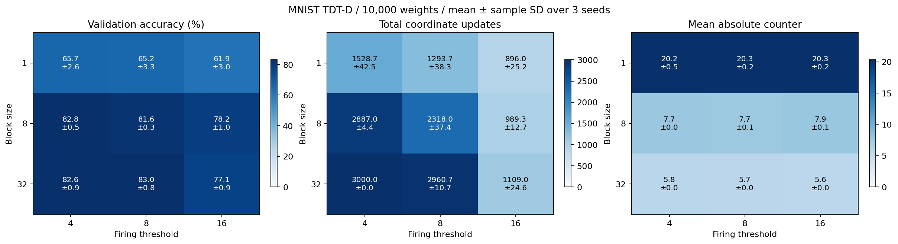

# MNIST TDT-D: ブロック・閾値・seedの比較

10,000重み、seed=[0, 1, 2]、訓練10000件、検証1000件、テスト10,000件。
入力プーリング=(9, 10)、隠れ層幅=100（0は線形モデル）、バイアスなし。
全条件でK=64、3000区間、batch=128、最大発火1座標。
各実験の訓練forwardは384,000回。測定例数も同一。
データ分割seedは0で固定。同じseedでは初期重みと独立した訓練バッチ乱数列を共有。
oracle監査は無効化し、評価回数も固定。計算効率の優劣は判定しない。
毎区間の終了時に全カウンタをリセットする同期方式。INT8の容量は±127。
平均±標本標準偏差（信頼区間ではない）。改善seed数は初期値に対する検証損失の低下。

| block | 閾値 | 検証精度 % | テスト精度 % | 発火数 | 損失改善seed |
| ---: | ---: | ---: | ---: | ---: | ---: |
| 1 | 4 | 65.67 ± 2.60 | 68.41 ± 1.41 | 1528.7 ± 42.5 | 3/3 |
| 1 | 8 | 65.20 ± 3.27 | 67.45 ± 2.60 | 1293.7 ± 38.3 | 3/3 |
| 1 | 16 | 61.90 ± 3.02 | 64.00 ± 2.66 | 896.0 ± 25.2 | 3/3 |
| 8 | 4 | 82.83 ± 0.51 | 84.54 ± 0.07 | 2887.0 ± 4.4 | 3/3 |
| 8 | 8 | 81.63 ± 0.31 | 83.93 ± 0.14 | 2318.0 ± 37.4 | 3/3 |
| 8 | 16 | 78.23 ± 0.96 | 79.83 ± 0.68 | 989.3 ± 12.7 | 3/3 |
| 32 | 4 | 82.63 ± 0.95 | 84.65 ± 1.13 | 3000.0 ± 0.0 | 3/3 |
| 32 | 8 | 83.03 ± 0.75 | 84.64 ± 0.73 | 2960.7 ± 10.7 | 3/3 |
| 32 | 16 | 77.07 ± 0.85 | 79.01 ± 1.18 | 1109.0 ± 24.6 | 3/3 |

## カウンタ分布

各区間で一度以上測定した辺の、リセット直前の値を集計。未訪問のゼロは除外。
符号付き平均は正負が相殺するので、絶対値平均も表示する。最大は全seed・全区間の最大絶対値。
飽和率は|C|=127の観測割合。閾値への到達率ではない。
counter_histograms.csvにseed別の完全な符号付きヒストグラムを保存。

| block | 閾値 | 符号付き平均C | 平均abs(C) | 最大abs(C) | 飽和率 % |
| ---: | ---: | ---: | ---: | ---: | ---: |
| 1 | 4 | -1.973 | 20.177 | 64 | 0.000 |
| 1 | 8 | -1.901 | 20.309 | 64 | 0.000 |
| 1 | 16 | -1.664 | 20.311 | 64 | 0.000 |
| 8 | 4 | -0.272 | 7.727 | 64 | 0.000 |
| 8 | 8 | -0.275 | 7.671 | 64 | 0.000 |
| 8 | 16 | -0.297 | 7.889 | 64 | 0.000 |
| 32 | 4 | -0.017 | 5.801 | 61 | 0.000 |
| 32 | 8 | -0.029 | 5.746 | 59 | 0.000 |
| 32 | 16 | -0.028 | 5.650 | 58 | 0.000 |

全seedの値はper_seed.csv、平均と標準偏差はaggregate.csv。
詳細ログ・設定・学習済み重み: `/root/lowbit-math-reasoning/tdt_mnist/runs/mnist-10000-grid-20260905`

3 seedの結果は今回の小規模モデル・固定蓄積方式に限定され、一般的な収束保証ではない。
テスト値で条件を選ぶと選択バイアスが生じるため、条件の判断には検証値を用いる。

## 2層の更新確認

全27実験で検証損失が初期値より低下し、両層とも更新されました。
第1層は90→100の9,000重み、第2層は100→10の1,000重みです。ReLUを挟み、逆伝播は使いません。
検証精度の最高平均はblock=32・閾値8の83.03±0.75%ですが、block=8・閾値4の82.83±0.51%も近い値でした。
1,000重み実験とは入力形状と層数も違うため、重み数だけの効果を切り分けた比較ではありません。

| block | 閾値 | 第1層の平均更新数 | 第2層の平均更新数 |
| ---: | ---: | ---: | ---: |
| 1 | 4 | 1384.3 | 144.3 |
| 1 | 8 | 1166.7 | 127.0 |
| 1 | 16 | 798.3 | 97.7 |
| 8 | 4 | 2540.7 | 346.3 |
| 8 | 8 | 2009.3 | 308.7 |
| 8 | 16 | 788.3 | 201.0 |
| 32 | 4 | 2608.0 | 392.0 |
| 32 | 8 | 2572.7 | 388.0 |
| 32 | 16 | 900.7 | 208.3 |



[学習曲線](learning_curves.png) / [カウンタ分布](counter_distributions.png)

再現コマンド（tdt_mnist内で実行、新規出力先）:

```bash
uv run python sweep.py --pool-shape 9 10 --hidden-size 100 --expected-params 10000 \
  --thresholds 4 8 16 --blocks 1 8 32 \
  --output-dir runs/mnist-10000-grid-repeat --report-dir results/mnist-10000-grid-repeat
```
