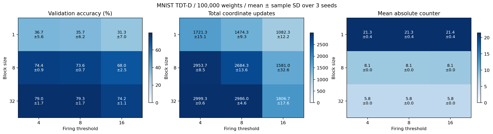

# MNIST TDT-D: ブロック・閾値・seedの比較

100,000重み、seed=[0, 1, 2]、訓練10000件、検証1000件、テスト10,000件。
入力プーリング=(9, 10)、隠れ層幅=1000（0は線形モデル）、バイアスなし。
全条件でK=64、3000区間、batch=128、最大発火1座標。
各実験の訓練forwardは384,000回。測定例数も同一。
データ分割seedは0で固定。同じseedでは初期重みと独立した訓練バッチ乱数列を共有。
oracle監査は無効化し、評価回数も固定。計算効率の優劣は判定しない。
毎区間の終了時に全カウンタをリセットする同期方式。INT8の容量は±127。
平均±標本標準偏差（信頼区間ではない）。改善seed数は初期値に対する検証損失の低下。

| block | 閾値 | 検証精度 % | テスト精度 % | 発火数 | 損失改善seed |
| ---: | ---: | ---: | ---: | ---: | ---: |
| 1 | 4 | 36.73 ± 5.59 | 35.56 ± 7.07 | 1721.3 ± 15.1 | 3/3 |
| 1 | 8 | 35.67 ± 6.19 | 34.73 ± 7.32 | 1474.3 ± 9.3 | 3/3 |
| 1 | 16 | 31.30 ± 6.95 | 30.81 ± 7.99 | 1082.3 ± 12.2 | 3/3 |
| 8 | 4 | 74.37 ± 0.92 | 74.84 ± 1.43 | 2953.7 ± 8.5 | 3/3 |
| 8 | 8 | 73.57 ± 0.65 | 74.50 ± 2.02 | 2684.3 ± 13.6 | 3/3 |
| 8 | 16 | 68.00 ± 2.46 | 69.56 ± 2.56 | 1581.0 ± 32.6 | 3/3 |
| 32 | 4 | 79.03 ± 1.66 | 79.78 ± 0.42 | 2999.3 ± 0.6 | 3/3 |
| 32 | 8 | 79.30 ± 1.71 | 80.09 ± 0.08 | 2986.0 ± 4.6 | 3/3 |
| 32 | 16 | 74.23 ± 1.12 | 75.73 ± 1.44 | 1806.7 ± 17.6 | 3/3 |

## カウンタ分布

各区間で一度以上測定した辺の、リセット直前の値を集計。未訪問のゼロは除外。
符号付き平均は正負が相殺するので、絶対値平均も表示する。最大は全seed・全区間の最大絶対値。
飽和率は|C|=127の観測割合。閾値への到達率ではない。
counter_histograms.csvにseed別の完全な符号付きヒストグラムを保存。

| block | 閾値 | 符号付き平均C | 平均abs(C) | 最大abs(C) | 飽和率 % |
| ---: | ---: | ---: | ---: | ---: | ---: |
| 1 | 4 | -0.887 | 21.280 | 64 | 0.000 |
| 1 | 8 | -0.841 | 21.300 | 64 | 0.000 |
| 1 | 16 | -0.744 | 21.439 | 64 | 0.000 |
| 8 | 4 | -0.144 | 8.099 | 64 | 0.000 |
| 8 | 8 | -0.147 | 8.084 | 64 | 0.000 |
| 8 | 16 | -0.129 | 8.126 | 64 | 0.000 |
| 32 | 4 | -0.037 | 5.760 | 61 | 0.000 |
| 32 | 8 | -0.029 | 5.759 | 61 | 0.000 |
| 32 | 16 | -0.038 | 5.756 | 61 | 0.000 |

全seedの値はper_seed.csv、平均と標準偏差はaggregate.csv。
詳細ログ・設定・学習済み重み: `/root/lowbit-math-reasoning/tdt_mnist/runs/mnist-100000-grid-20260905`

3 seedの結果は今回の小規模モデル・固定蓄積方式に限定され、一般的な収束保証ではない。
テスト値で条件を選ぶと選択バイアスが生じるため、条件の判断には検証値を用いる。

## 10,000パラメータ時との比較

全27条件で検証損失が初期値より低下し、90,000重みの第1層・10,000重みの第2層がともに更新されました。
検証精度の最高平均はblock=32・閾値8の79.30±1.71%で、テスト精度は80.09±0.08%でした。
同じblock=32・閾値8の10,000パラメータ実験は検証83.03±0.75%でした。
今回は同じ3,000区間・最大1座標更新という条件であり、長時間学習後の到達精度を比較したものではありません。
入力形状・データ分割・学習則・測定数は同じで、隠れ層幅を100から1,000に変更しています。

| block | 閾値 | 10,000重みの検証精度 % | 100,000重みの検証精度 % | 差（ポイント） |
| ---: | ---: | ---: | ---: | ---: |
| 1 | 4 | 65.67 | 36.73 | -28.93 |
| 1 | 8 | 65.20 | 35.67 | -29.53 |
| 1 | 16 | 61.90 | 31.30 | -30.60 |
| 8 | 4 | 82.83 | 74.37 | -8.47 |
| 8 | 8 | 81.63 | 73.57 | -8.07 |
| 8 | 16 | 78.23 | 68.00 | -10.23 |
| 32 | 4 | 82.63 | 79.03 | -3.60 |
| 32 | 8 | 83.03 | 79.30 | -3.73 |
| 32 | 16 | 77.07 | 74.23 | -2.83 |

## 層別更新数

| block | 閾値 | 第1層の平均更新数 | 第2層の平均更新数 |
| ---: | ---: | ---: | ---: |
| 1 | 4 | 1532.3 | 189.0 |
| 1 | 8 | 1305.0 | 169.3 |
| 1 | 16 | 946.3 | 136.0 |
| 8 | 4 | 2398.0 | 555.7 |
| 8 | 8 | 2149.3 | 535.0 |
| 8 | 16 | 1180.3 | 400.7 |
| 32 | 4 | 2252.7 | 746.7 |
| 32 | 8 | 2234.3 | 751.7 |
| 32 | 16 | 1237.7 | 569.0 |



[学習曲線](learning_curves.png) / [カウンタ分布](counter_distributions.png)

再現コマンド（tdt_mnist内で実行）:

```bash
uv run python sweep.py --pool-shape 9 10 --hidden-size 1000 --expected-params 100000 \
  --thresholds 4 8 16 --blocks 1 8 32 \
  --output-dir runs/mnist-100000-repeat --report-dir results/mnist-100000-repeat
```
