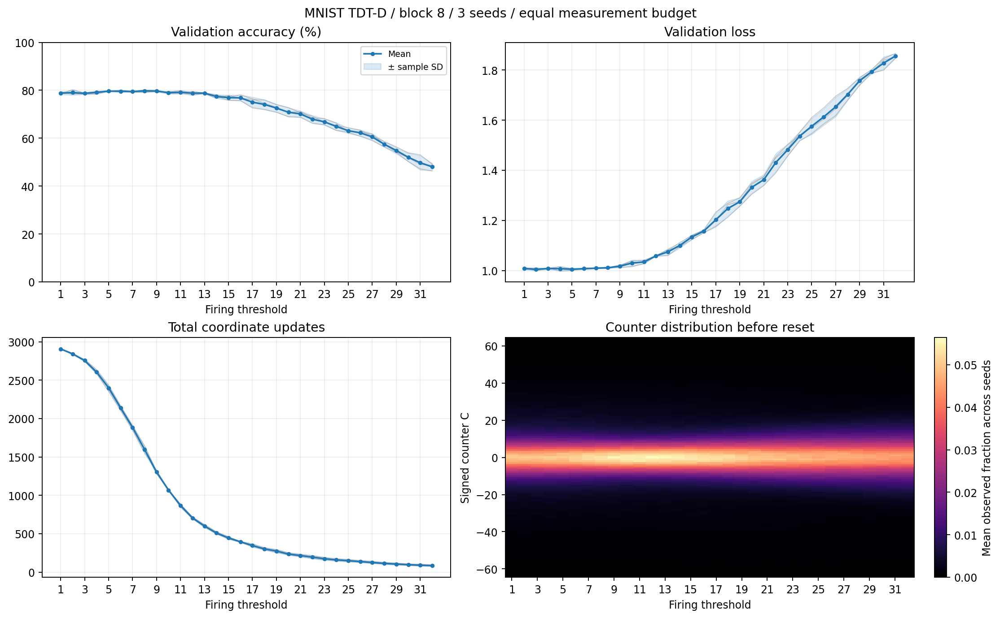

# MNIST TDT-D: ブロック・閾値・seedの比較

## 結果の読み取り

全96条件で検証損失が初期値より低下しました。検証精度の平均が最も高かった閾値は8で、
79.73±0.55%（標本標準偏差）でした。ただし閾値5～9は79.47～79.73%と近接しており、
閾値8だけが明確に優れると結論する結果ではありません。
閾値14以降では精度が低下する傾向があり、32では48.03±1.51%でした。
平均発火数は閾値1の2,908回から閾値32の85.3回へ減少しました。
今回の64回蓄積・区間末リセット方式における結果です。閾値1も即時更新方式ではありません。
全条件の測定回数・集計を照合し、既存の閾値4・8・16・32は各seedで前回の数値を完全再現しました。

図は[SVG形式](threshold_comparison.svg)でも保存しています。

1,000重み、seed=[0, 1, 2]、訓練10000件、検証1000件、テスト10,000件。
全条件でK=64、3000区間、batch=128、最大発火1座標。
各実験の訓練forwardは384,000回。測定例数も同一。
データ分割seedは0で固定。同じseedでは初期重みと独立した訓練バッチ乱数列を共有。
oracle監査は無効化し、評価回数も固定。計算効率の優劣は判定しない。
毎区間の終了時に全カウンタをリセットする同期方式。INT8の容量は±127。
平均±標本標準偏差（信頼区間ではない）。改善seed数は初期値に対する検証損失の低下。

| block | 閾値 | 検証精度 % | テスト精度 % | 発火数 | 損失改善seed |
| ---: | ---: | ---: | ---: | ---: | ---: |
| 8 | 1 | 78.80 ± 0.53 | 80.81 ± 0.32 | 2908.0 ± 5.0 | 3/3 |
| 8 | 2 | 79.07 ± 1.08 | 81.42 ± 0.21 | 2843.7 ± 6.7 | 3/3 |
| 8 | 3 | 78.70 ± 0.36 | 81.05 ± 0.72 | 2756.7 ± 14.4 | 3/3 |
| 8 | 4 | 79.10 ± 0.61 | 81.67 ± 0.64 | 2606.7 ± 27.2 | 3/3 |
| 8 | 5 | 79.63 ± 0.21 | 81.41 ± 0.77 | 2400.3 ± 40.8 | 3/3 |
| 8 | 6 | 79.60 ± 0.44 | 81.64 ± 0.88 | 2139.7 ± 31.3 | 3/3 |
| 8 | 7 | 79.47 ± 0.23 | 81.56 ± 0.55 | 1883.7 ± 31.8 | 3/3 |
| 8 | 8 | 79.73 ± 0.55 | 82.39 ± 0.23 | 1598.3 ± 46.5 | 3/3 |
| 8 | 9 | 79.67 ± 0.40 | 81.78 ± 0.53 | 1304.0 ± 21.0 | 3/3 |
| 8 | 10 | 79.00 ± 0.46 | 81.97 ± 0.92 | 1068.7 ± 7.6 | 3/3 |
| 8 | 11 | 79.17 ± 0.64 | 81.54 ± 0.33 | 868.7 ± 20.5 | 3/3 |
| 8 | 12 | 78.77 ± 0.75 | 81.03 ± 0.60 | 706.0 ± 12.5 | 3/3 |
| 8 | 13 | 78.80 ± 0.17 | 80.68 ± 0.19 | 601.3 ± 17.6 | 3/3 |
| 8 | 14 | 77.40 ± 0.75 | 79.85 ± 0.21 | 510.0 ± 14.7 | 3/3 |
| 8 | 15 | 76.93 ± 1.06 | 78.50 ± 1.14 | 446.0 ± 15.5 | 3/3 |
| 8 | 16 | 76.83 ± 1.21 | 78.28 ± 0.69 | 395.0 ± 5.3 | 3/3 |
| 8 | 17 | 75.03 ± 2.11 | 76.93 ± 1.83 | 347.0 ± 19.5 | 3/3 |
| 8 | 18 | 74.10 ± 2.03 | 76.27 ± 1.66 | 303.0 ± 15.1 | 3/3 |
| 8 | 19 | 72.57 ± 1.63 | 74.72 ± 1.89 | 275.7 ± 19.0 | 3/3 |
| 8 | 20 | 70.83 ± 1.90 | 73.23 ± 1.59 | 236.0 ± 15.6 | 3/3 |
| 8 | 21 | 70.13 ± 1.29 | 72.67 ± 1.79 | 216.7 ± 16.2 | 3/3 |
| 8 | 22 | 67.93 ± 1.55 | 70.25 ± 2.03 | 196.3 ± 19.2 | 3/3 |
| 8 | 23 | 66.83 ± 1.31 | 68.27 ± 1.28 | 175.0 ± 17.1 | 3/3 |
| 8 | 24 | 64.90 ± 1.57 | 66.54 ± 1.36 | 160.0 ± 14.2 | 3/3 |
| 8 | 25 | 63.13 ± 1.10 | 64.95 ± 1.79 | 149.7 ± 14.6 | 3/3 |
| 8 | 26 | 62.23 ± 1.29 | 63.44 ± 1.72 | 138.0 ± 13.2 | 3/3 |
| 8 | 27 | 60.53 ± 1.39 | 61.63 ± 2.25 | 126.3 ± 13.7 | 3/3 |
| 8 | 28 | 57.47 ± 1.15 | 58.42 ± 1.19 | 114.3 ± 12.1 | 3/3 |
| 8 | 29 | 54.87 ± 1.33 | 55.94 ± 1.94 | 106.0 ± 12.3 | 3/3 |
| 8 | 30 | 52.03 ± 1.80 | 53.34 ± 1.20 | 97.3 ± 9.7 | 3/3 |
| 8 | 31 | 49.77 ± 3.02 | 50.94 ± 2.55 | 91.0 ± 12.5 | 3/3 |
| 8 | 32 | 48.03 ± 1.51 | 49.14 ± 2.02 | 85.3 ± 9.5 | 3/3 |

## カウンタ分布

各区間で一度以上測定した辺の、リセット直前の値を集計。未訪問のゼロは除外。
符号付き平均は正負が相殺するので、絶対値平均も表示する。最大は全seed・全区間の最大絶対値。
飽和率は|C|=127の観測割合。閾値への到達率ではない。
counter_histograms.csvにseed別の完全な符号付きヒストグラムを保存。

| block | 閾値 | 符号付き平均C | 平均abs(C) | 最大abs(C) | 飽和率 % |
| ---: | ---: | ---: | ---: | ---: | ---: |
| 8 | 1 | 0.072 | 8.661 | 63 | 0.000 |
| 8 | 2 | 0.064 | 8.678 | 64 | 0.000 |
| 8 | 3 | 0.077 | 8.646 | 64 | 0.000 |
| 8 | 4 | 0.056 | 8.588 | 63 | 0.000 |
| 8 | 5 | 0.084 | 8.528 | 63 | 0.000 |
| 8 | 6 | 0.092 | 8.425 | 63 | 0.000 |
| 8 | 7 | 0.072 | 8.313 | 63 | 0.000 |
| 8 | 8 | 0.063 | 8.169 | 64 | 0.000 |
| 8 | 9 | 0.047 | 8.056 | 63 | 0.000 |
| 8 | 10 | 0.054 | 7.952 | 63 | 0.000 |
| 8 | 11 | 0.048 | 7.921 | 63 | 0.000 |
| 8 | 12 | 0.019 | 7.854 | 64 | 0.000 |
| 8 | 13 | 0.028 | 7.867 | 64 | 0.000 |
| 8 | 14 | -0.010 | 7.875 | 64 | 0.000 |
| 8 | 15 | -0.016 | 7.888 | 63 | 0.000 |
| 8 | 16 | -0.021 | 7.941 | 63 | 0.000 |
| 8 | 17 | -0.031 | 7.954 | 63 | 0.000 |
| 8 | 18 | -0.046 | 8.001 | 63 | 0.000 |
| 8 | 19 | -0.040 | 8.065 | 64 | 0.000 |
| 8 | 20 | -0.079 | 8.113 | 63 | 0.000 |
| 8 | 21 | -0.075 | 8.156 | 64 | 0.000 |
| 8 | 22 | -0.086 | 8.145 | 64 | 0.000 |
| 8 | 23 | -0.101 | 8.180 | 64 | 0.000 |
| 8 | 24 | -0.091 | 8.201 | 64 | 0.000 |
| 8 | 25 | -0.089 | 8.231 | 64 | 0.000 |
| 8 | 26 | -0.097 | 8.246 | 64 | 0.000 |
| 8 | 27 | -0.092 | 8.274 | 64 | 0.000 |
| 8 | 28 | -0.083 | 8.309 | 64 | 0.000 |
| 8 | 29 | -0.082 | 8.365 | 64 | 0.000 |
| 8 | 30 | -0.073 | 8.406 | 64 | 0.000 |
| 8 | 31 | -0.062 | 8.438 | 64 | 0.000 |
| 8 | 32 | -0.065 | 8.468 | 64 | 0.000 |

全seedの値はper_seed.csv、平均と標準偏差はaggregate.csv。
詳細ログ・設定・学習済み重み: `/root/lowbit-math-reasoning/tdt_mnist/runs/threshold-1-32-20260905`

3 seedの結果は今回の小規模モデル・固定蓄積方式に限定され、一般的な収束保証ではない。
テスト値で条件を選ぶと選択バイアスが生じるため、条件の判断には検証値を用いる。
